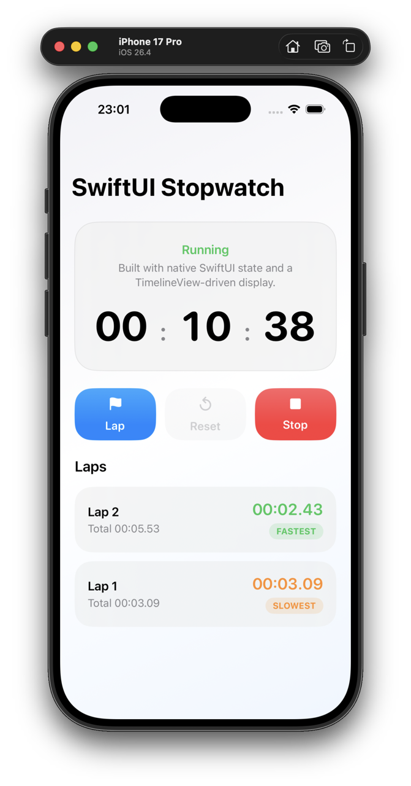
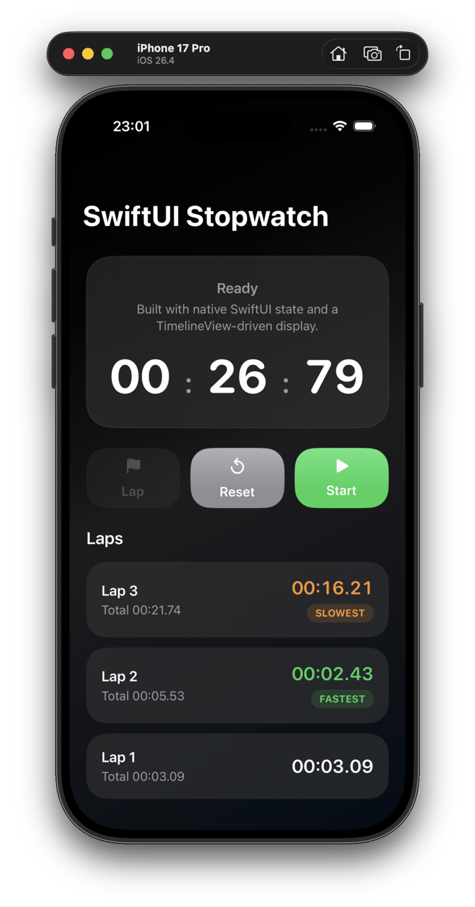

# Stopwatch

`Stopwatch` is a small open source sample that builds the same stopwatch experience three ways:

1. `UIKit - Traditional`
2. `UIKit - DiffableDatasource`
3. `SwiftUI`

The goal of the project is still the same: compare how the same product idea feels when it is implemented with classic UIKit patterns, modern UIKit APIs, and native SwiftUI.

This refreshed version targets `iOS 26.0` and modernizes all three apps from scratch while keeping the original purpose of the repository intact.

## What Changed

All three apps now share the same overall experience:

- Start / stop timing
- Capture laps
- Reset when stopped
- Highlight the fastest and slowest laps
- Use a cleaner, more current visual style

Each target focuses on a different implementation style:

## Project 1: UIKit Traditional

This version keeps the classic UIKit approach:

- `UIViewController`
- Manual `UITableViewDataSource` and `UITableViewDelegate`
- Custom table view cell registration with reuse identifiers
- Explicit view hierarchy and layout code

## Project 2: UIKit Modern

This version shows a more current UIKit style:

- `UITableViewDiffableDataSource`
- Snapshot-driven updates
- Programmatic custom cells with reusable registration
- Configuration-based buttons

## Project 3: SwiftUI

This version uses a native SwiftUI app lifecycle and modern SwiftUI state:

- `@main` SwiftUI app entry point
- `@Observable` stopwatch model
- `TimelineView` for the live timer display
- Small composable views instead of UIKit lifecycle wrappers

## Why This Repo Exists

The project is intentionally small so the differences between the three approaches are easy to inspect. It is meant to be a practical side-by-side reference, not a large production architecture sample.

## Contributing

Contributions are welcome and appreciated.

- Fork the project
- Create your feature branch `git checkout -b feature/AmazingFeature`
- Commit your changes `git commit -m 'Add some AmazingFeature'`
- Push to the branch `git push origin feature/AmazingFeature`
- Open a pull request

## License

See [LICENSE](LICENSE)

## Contact

Leonardo Bilia - [@leonardobilia](https://twitter.com/leonardobilia)
