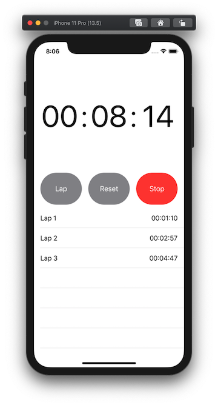
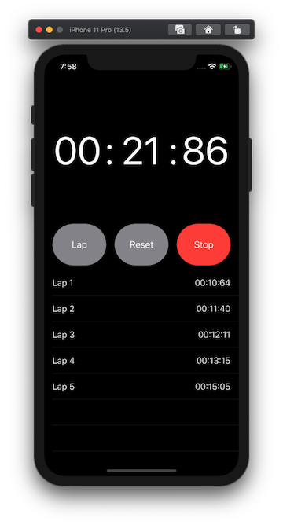

# Stopwatch
This is a simple Stopwatch app to demonstrate the differences between UIKit and SwiftUI.

The ideia was to build the same app three times to represent the “old”  and the “new” way of creating a table view in UIKit. Then, I wrote the same exact app in SwiftUI.

I tried not to worry about architecture, patterns, test, or anything other than just showing the base differences between the three approaches.

## Project 1: UIKit Tradicional.
Using the great and most common way of writing table view using Datasources and Delegates.

## Project 2: UIKit- Diffable Datasource.
Here you can see a very simple way of implementing the new Diffable Datasource and snapshot to update the UI without needing indexpath.row or array.count. Update the snapshot and you UI will reflect immediately.

## Project 3: SwiftUI.
My preferred way of writing apps lately. With just half of the number of lines of code in comparison to projects 1 and 2.

# Contributing

Contributions are what make the open source community such a fantastic place to learn, share, inspire, and create. Any contributions you make are greatly appreciated.

- Fork the project
- Create your feature branch `git checkout -b feature/AmazingFeature`
- Commit your changes `git commit -m 'Add some AmazingFeature'`
- Push to the branch `git push origin feature/AmazingFeature`
- Open a pull request

# License

See [LICENSE](LICENSE)

# Contact

Leonardo Bilia - [@leonardobilia](https://twitter.com/leonardobilia)